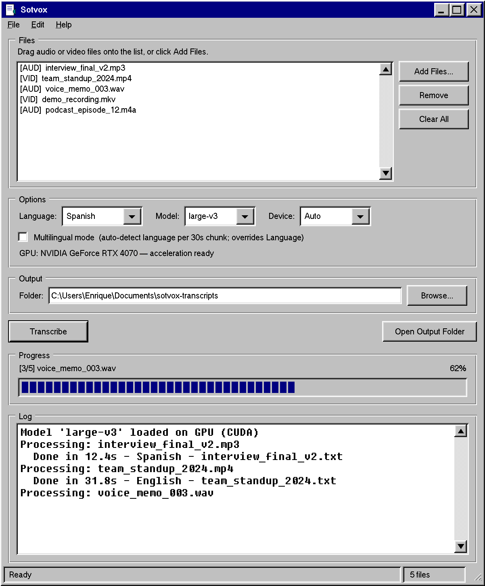

# Sotvox

Turn audio and video into text on your own PC. No internet, no account, no subscription.

## Install

1. Download **[Sotvox-Setup.exe](https://github.com/EnriqueOliva/sotvox/releases/latest)**
2. Run it and follow the wizard
3. Open **Sotvox** from the Start Menu

Windows 10 or 11. Nothing else to install.

## Use it

1. Drag your files onto the list
2. Click **Transcribe**
3. Click **Open Output Folder** to read the results

Each file becomes a `.txt` next to the others in `Documents\sotvox-transcripts`.

**Audio:** mp3, wav, m4a, ogg, flac, wma, aac
**Video:** mp4, mkv, avi, mov, webm, wmv, ts, flv

## Options

| Setting | What it does |
| --- | --- |
| **Language** | The language spoken in your files, or *Auto-detect* |
| **Model** | `large-v3` is the most accurate, `tiny` the fastest |
| **Device** | Leave on *Auto* |
| **Multilingual mode** | For files that switch between languages |
| **Folder** | Where transcripts are saved |

## Good to know

- The first transcription downloads the speech model (about 1.5 GB). It only happens once.
- Have an NVIDIA graphics card? Click **Enable GPU Acceleration** in Options to transcribe much faster.
- Windows may say the publisher is unknown. Choose **More info → Run anyway**.

## License

MIT. Built on [faster-whisper](https://github.com/SYSTRAN/faster-whisper).
