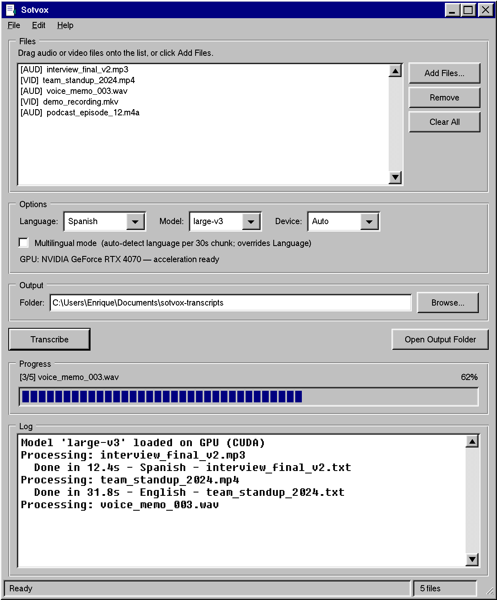

# Sotvox

Turn audio and video into text on your own PC. No internet, no account, no subscription.



## Install

### Windows

1. Download **[Sotvox-Setup.exe](https://github.com/EnriqueOliva/sotvox/releases/latest)**
2. Run it and follow the wizard
3. Open **Sotvox** from the Start Menu

Windows 10 or 11. Nothing else to install.

### macOS

1. Download **Sotvox-macOS.dmg** (or build it yourself, see [Build on macOS](#build-on-macos))
2. Open it and drag **Sotvox** into **Applications**
3. The first time, macOS will refuse to open it because the app is not notarized by Apple. Go to **System Settings** → **Privacy & Security**, scroll down and click **Open Anyway**

macOS 11 or newer on Apple Silicon. Nothing else to install.

## Use it

1. Drag your files onto the list
2. Click **Transcribe**
3. Click **Open Output Folder** to read the results

Each file becomes a `.txt` next to the others in `Documents\sotvox-transcripts` (`~/Documents/sotvox-transcripts` on macOS).

**Audio:** mp3, wav, m4a, ogg, flac, wma, aac
**Video:** mp4, mkv, avi, mov, webm, wmv, ts, flv

## Options

| Setting | What it does |
| --- | --- |
| **Language** | The language spoken in your files, or *Auto-detect* |
| **Model** | `large-v3` is the most accurate, `large-v3-turbo` nearly as good but much faster |
| **Device** | Leave on *Auto* (macOS always uses the CPU) |
| **Multilingual mode** | For files that switch between languages |
| **Folder** | Where transcripts are saved |

## Good to know

- The first transcription downloads the speech model (about 1.5 GB). It only happens once.
- Have an NVIDIA graphics card? Click **Enable GPU Acceleration** in Options to transcribe much faster. (Windows only — Macs have no CUDA, so Sotvox runs on the CPU there; `large-v3-turbo` is the best pick.)
- Windows may say the publisher is unknown. Choose **More info → Run anyway**.
- Automating it? There's a [headless batch mode](automation/auto-transcribe/).

## Build on macOS

```bash
setup/setup.sh              # installs uv, Python 3.11 and the dependencies into .venv
./launch.command            # run from source (or double-click it in Finder)
.venv/bin/python -m pytest tests
installer/build_mac.sh      # builds installer/dist_app/Sotvox.app and Sotvox-macOS.dmg
```

Logs are in `~/Library/Logs/Sotvox`.

## License

MIT. Built on [faster-whisper](https://github.com/SYSTRAN/faster-whisper).
